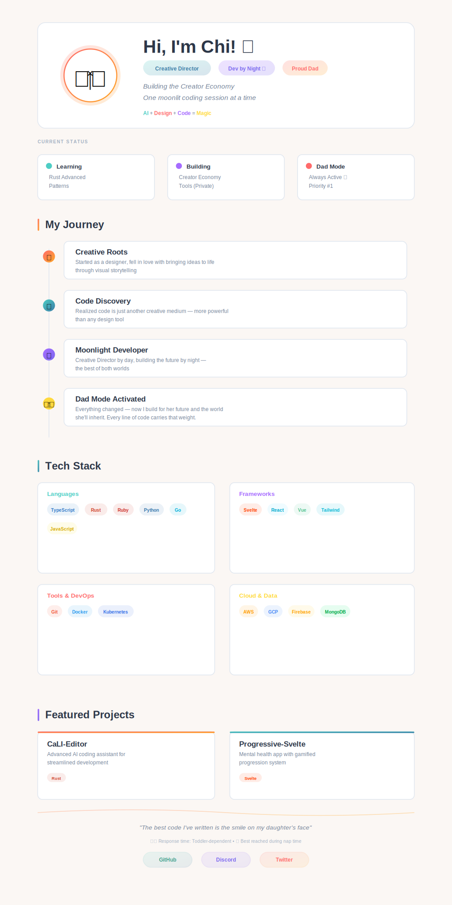

 

 

 

# 👨‍👧 Life's Greatest Project

When I'm not coding or directing, I'm having dance parties and sharing laughs with my incredible one-year-old daughter. She's my greatest source of inspiration and joy - nothing beats creating memories together through music, giggles, and countless precious moments.

# 💭 Why I Build

Every line of code I write carries the weight of creating a better world for my daughter. As a Creative Director by day and developer by moonlight, I've discovered that the intersection of design, technology, and fatherhood isn't just a balancing act—it's a powerful synergy.

**My mission:** Build tools and platforms that empower the next generation of creators while showing my daughter that dreams are built through dedication, learning, and a dash of moonlit coding sessions.

> *When she asks "What does daddy do?", I want to show her projects that made a difference.*

## 📊 This Week's Focus

<table>
<tr>
<td align="center" width="33%">
<h4>🚀 Building</h4>

<strong>CaLI-Editor</strong>

<small>Enhancing AI coding features</small>

</td>
<td align="center" width="33%">
<h4>📚 Learning</h4>

<strong>Rust Advanced Patterns</strong>

<small>Performance optimization</small>

</td>
<td align="center" width="33%">
<h4>🎯 Goal</h4>

<strong>Mental Health Platform</strong>

<small>Progressive-Svelte v2.0</small>

</td>
</tr>
</table>

# 🚀 All Projects

<h3 style="display: inline">View all projects</h3>

<!-- Left Column -->

## 🤖 AI & Development Tools

<h4><a href="https://github.com/sachicali/CaLI-Editor" style="color: #58a6ff;">CaLI-Editor</a></h4>
<blockquote>An advanced AI Coding assistant that leverages and benchmarks latest features</blockquote>
<code>Built with: Rust 🦀</code> <code>Status: Active Development 🟢</code>

<h4><a href="https://github.com/sachicali/Pipelines-Cali" style="color: #58a6ff;">Pipelines-Cali</a></h4>
<blockquote>Ruby-based Project Management for Creator Economy</blockquote>
<code>Built with: Ruby 💎</code>

<h4><a href="https://github.com/sachicali/CALICommander" style="color: #58a6ff;">CALICommander</a></h4>
<blockquote>Go-powered Discord command-line interface</blockquote>
<code>Multi-language implementation</code>

## 🎮 Gaming & Mental Health

<h4><a href="https://github.com/sachicali/progressive-svelte" style="color: #58a6ff;">progressive-svelte</a></h4>
<blockquote>A Mental Health application that incorporates Game Link features</blockquote>
<code>Gamified progression</code> <code>Built with: Svelte ⚡</code>

## 🎨 Creative Suite

<h4><a href="https://github.com/sachicali/PoetryRaw" style="color: #58a6ff;">PoetryRaw</a></h4>
<blockquote>My digital garden of thoughts</blockquote>
<code>Creative writing platform</code>

<h4><a href="https://github.com/sachicali/ImagineCali" style="color: #58a6ff;">ImagineCali</a></h4>
<blockquote>TypeScript-based creative tools</blockquote>
<code>Creator Economy focus</code>

<!-- Right Column -->

## 🌐 Web Development

<h4><a href="https://github.com/sachicali/CaliSite" style="color: #58a6ff;">CaliSite</a></h4>
<blockquote>Modern web platform with focus on CSS</blockquote>
<code>Learning playground</code>

<h4><a href="https://github.com/sachicali/caliSuperComp" style="color: #58a6ff;">caliSuperComp</a></h4>
<blockquote>AI Super Comp. Super super heavy.</blockquote>
<code>⚠️ High GPU requirements</code>

## ⚙️ Automation & Management

<h4><a href="https://github.com/sachicali/calinternal-manager" style="color: #58a6ff;">calinternal-manager</a></h4>
<blockquote>Python-based internal management system</blockquote>
<code>Learning project</code>

<h4><a href="https://github.com/sachicali/CALIProd" style="color: #58a6ff;">CALIProd</a></h4>
<blockquote>Production-grade Ruby tooling</blockquote>
<code>Status: Maintained 🟡</code>

# 📈 GitHub Activity

# 💫 Connect With Me

<i>The best way to reach me is through telepathy... but since that's not reliable:</i>

 

> *"The best code I've written is the smile on my daughter's face, the best direction I've taken is Fatherhood"*

 

⚠️ *Responses may come slower than Windows updates (Toddler-dependent)*

🌙 *Best reached during nap time*

